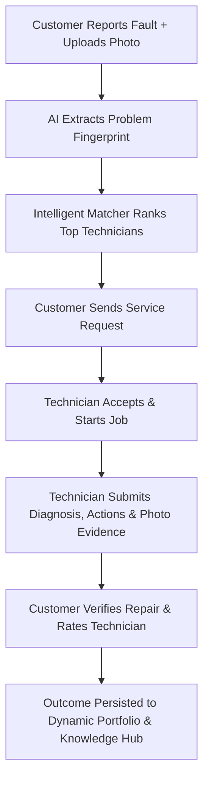

# 🛠️ KaushalSetu (कौशल सेतु)
### AI-Driven Experience Mapping & Intelligent Opportunity Matching Platform

[](https://python.org)
[](https://fastapi.tiangolo.com)
[](https://flutter.dev)
[](https://supabase.com)

**KaushalSetu** connects electronics and electrical repair technicians (electricians, board-level micro-soldering specialists, inverter technicians) with customers needing urgent diagnostic repairs. By leveraging **AI problem fingerprinting**, **dynamic experience mapping**, and **multi-factor proximity matching**, KaushalSetu transforms everyday repair jobs into verified technician credentials and searchable knowledge cases.

---

## 🌟 Key Features

* **Dual-Mode Experience (Customer & Technician)**:
  * Seamless one-click mode switching (like modern gig platforms).
  * Technicians can act as customers to hire peer specialists or post repairs.
  * In-app technician onboarding with skill selection and service radius configuration.
* **AI Problem Fingerprint Extraction**:
  * Transforms plain-language customer complaints into structured hardware failure hypotheses, suspected component lists, and required technician competencies.
* **Intelligent Opportunity Matching Engine**:
  * Multi-factor scoring algorithm:
    $$\text{Match Score} = 0.40 \times \text{Prob\_Sim} + 0.30 \times \text{Ctx\_Sim} + 0.20 \times \text{Verified\_Exp} + 0.10 \times \text{Proximity}$$
  * Ranks the top specialist technicians within travel radius with explainable match reasons.
* **End-to-End Service & Job Lifecycle**:
  * Real-time request dispatching, technician acceptance, progress tracking, and on-site diagnosis logs.
  * Before/after photographic evidence capture saved securely in Supabase Storage.
* **Customer Signoff & Dynamic Portfolio**:
  * Verified job outcomes become permanent credentials on technician profiles.
  * Reusable knowledge cases published to the peer Knowledge Hub.
* **Real-time Notifications**:
  * Immediate status updates for request dispatch, job confirmation, and completion.

---

## 🏗️ Architecture & Technology Stack

| Layer | Technologies |
| :--- | :--- |
| **Frontend** | Flutter (Dart), Web & Mobile Responsive, Provider State Management |
| **Backend** | FastAPI (Python 3.12), Pydantic v2, Uvicorn, AnyIO |
| **Database & Auth** | Supabase PostgreSQL (25 normalized tables), Supabase Auth (JWT) |
| **Object Storage** | Supabase Storage (`problem-media`, `experience-media`) |
| **Testing** | Pytest, HTTPX, Live Supabase Persistence Integration Tests |

---

## 🚀 Golden Path Workflow



---

## 📁 Repository Structure

```text
Kaushal-Setu/
├── backend/
│   ├── api/
│   │   ├── deps.py               # JWT authentication, role guards & ownership checks
│   │   └── routes/               # Modular FastAPI route controllers
│   │       ├── auth.py           # Registration & session management
│   │       ├── problems.py       # Problem submission & fingerprinting
│   │       ├── matching.py       # Multi-factor technician matching
│   │       ├── service_requests.py # Service request lifecycle
│   │       ├── jobs.py           # Job progression & diagnostic logs
│   │       ├── verification.py   # Customer job verification
│   │       ├── feedback.py       # Star ratings and reviews
│   │       ├── knowledge.py      # Searchable repair Knowledge Hub
│   │       └── notifications.py  # User notifications
│   ├── db/
│   │   ├── schema.sql            # Complete 25-table PostgreSQL DDL schema
│   │   ├── seed.sql              # Initial demo data & seed specialists
│   │   └── supabase_client.py    # Hybrid Supabase DB sync & caching client
│   ├── schemas/                  # Strict Pydantic models for validation
│   ├── services/                 # AI fingerprinting, matching algorithm, lifecycle
│   ├── tests/                    # Automated pytest test suites
│   ├── config.py                 # Pydantic BaseSettings & timezone handling
│   └── main.py                   # FastAPI application entry point
├── kaushalsetu/                  # Flutter Client Application
│   ├── lib/
│   │   ├── core/                 # Auth provider, HTTP ApiClient, AppTheme
│   │   ├── models/               # Strongly-typed Dart data models
│   │   ├── screens/              # Customer & Technician UI screens
│   │   ├── services/             # Frontend HTTP service abstractions
│   │   └── widgets/              # Reusable UI cards, uploaders, and dialogs
│   └── pubspec.yaml
├── .env.example                  # Environment configuration template
├── .gitignore                    # Git ignore file protecting keys and build artifacts
├── pyrightconfig.json
└── requirements.txt              # Python dependency specification
```

---

## 🛠️ Getting Started

### 1. Prerequisites
* **Python 3.10+** (Python 3.12 recommended)
* **Flutter SDK 3.x+** with Chrome or Android/iOS toolchains
* **Supabase Project** with PostgreSQL database and Storage enabled

---

### 2. Environment Configuration

Copy `.env.example` to create your `.env` file in the project root:

```bash
cp .env.example .env
```

Fill in your real Supabase credentials:

```ini
PYTHONPATH=..
SUPABASE_URL=https://your-project-ref.supabase.co
SUPABASE_KEY=your_supabase_anon_key
SUPABASE_JWT_SECRET=your_supabase_jwt_secret
SUPABASE_SERVICE_ROLE_KEY=your_supabase_service_role_key

STORAGE_BUCKET_PROBLEM=problem-media
STORAGE_BUCKET_EXPERIENCE=experience-media

API_V1_STR=/api/v1
PROJECT_NAME=KaushalSetu
```

---

### 3. Backend Setup

1. **Create and activate a virtual environment**:
   ```bash
   # Windows (PowerShell)
   python -m venv venv
   .\venv\Scripts\Activate.ps1

   # Linux/macOS
   python3 -m venv venv
   source venv/bin/activate
   ```

2. **Install dependencies**:
   ```bash
   pip install -r requirements.txt
   ```

3. **Initialize Database Tables (Supabase)**:
   * Execute [`backend/db/schema.sql`](file:///c:/Users/Sanika/Kaushal-Setu/backend/db/schema.sql) in your **Supabase SQL Editor**.
   * Execute [`backend/db/seed.sql`](file:///c:/Users/Sanika/Kaushal-Setu/backend/db/seed.sql) to seed default skills and verified specialists.

4. **Run the FastAPI Development Server**:
   ```bash
   uvicorn backend.main:app --reload --port 8000
   ```
   * Interactive Swagger UI: [http://localhost:8000/docs](http://localhost:8000/docs)
   * Health Check: [http://localhost:8000/health](http://localhost:8000/health)

---

### 4. Frontend Setup (Flutter)

1. **Navigate to the Flutter directory**:
   ```bash
   cd kaushalsetu
   ```

2. **Install Flutter packages**:
   ```bash
   flutter pub get
   ```

3. **Launch the application**:
   ```bash
   # Run on Chrome (Web)
   flutter run -d chrome

   # Run on connected Mobile device/emulator
   flutter run
   ```

---

## 🧪 Running Tests

Run the complete backend automated test suite:

```bash
python -m pytest backend/tests/test_api.py -v
```

---

## 🔒 Security & Git Hygiene

* **Secrets**: Never commit `.env` or files containing database service keys to Git.
* **Storage**: Media uploads use authenticated Supabase Storage URLs with MIME type validation.
* **Authorization**: All endpoints enforce strict user ownership checks (users can only modify their own problems, jobs, and requests).

---

## 📄 License

This project is licensed under the MIT License.
